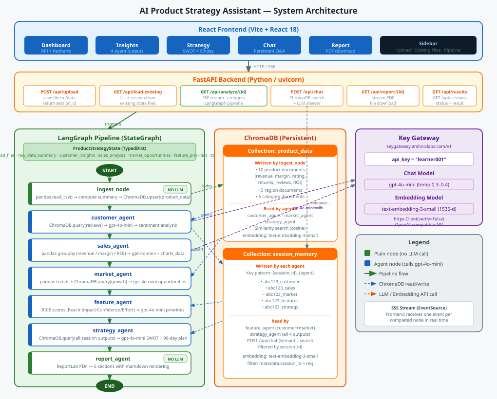

# AI Product Strategy Assistant



An AI-powered multi-agent system that analyzes product sales data and generates strategic business insights. Built with LangGraph, ChromaDB, FastAPI, and React.

---

## Features

- **7-node LangGraph pipeline** — sequential agents each specializing in one analysis domain
- **ChromaDB vector storage** — two collections for product data and session memory
- **Live streaming** — real-time agent progress via Server-Sent Events (SSE)
- **Interactive chat** — ask natural language questions over all analysis results
- **RICE scoring** — automated feature prioritization with computed scores
- **SWOT + 90-day plan** — synthesized strategic recommendations
- **PDF report** — downloadable 6-section executive report with formatted markdown
- **Existing file support** — use CSV files already in the data folder without re-uploading

---

## Quick Start

### 1. Backend

```bash
cd backend
pip install -r ../requirements.txt
uvicorn main:app --reload --port 8000
```

### 2. Frontend

```bash
cd frontend
npm install
npm run dev
```

Open **http://localhost:3000**

---

## Project Structure

```
product_strategy_assistant/
│
├── requirements.txt
├── architecture.md          ← system architecture diagram
│
├── backend/
│   ├── .env                 ← OPENAI_API_KEY=learner001
│   ├── config.py            ← API gateway config (keygateway.arshnivlabs.com)
│   ├── state.py             ← ProductStrategyState TypedDict
│   ├── chroma_store.py      ← ChromaDB client + 2 collections
│   ├── graph.py             ← LangGraph StateGraph (7 nodes)
│   ├── main.py              ← FastAPI app + all API routes
│   │
│   ├── nodes/
│   │   └── ingest_node.py   ← pandas CSV → ChromaDB index (no LLM)
│   │
│   ├── agents/
│   │   ├── customer_agent.py   ← sentiment + ratings analysis
│   │   ├── sales_agent.py      ← revenue, margin, ROI analysis
│   │   ├── market_agent.py     ← growth opportunities, regional trends
│   │   ├── feature_agent.py    ← RICE scoring + prioritization
│   │   ├── strategy_agent.py   ← SWOT + 90-day action plan
│   │   └── report_agent.py     ← PDF generation coordinator
│   │
│   └── utils/
│       └── pdf_generator.py    ← ReportLab PDF with markdown rendering
│
└── frontend/
    ├── package.json
    ├── vite.config.js
    ├── index.html
    └── src/
        ├── App.jsx              ← 5-tab shell, persistent state
        ├── main.jsx
        ├── index.css
        │
        ├── api/
        │   └── client.js        ← uploadFiles, streamAnalysis, chat, reportUrl
        │
        └── components/
            ├── Sidebar.jsx      ← file upload + existing files + pipeline progress
            ├── Dashboard.jsx    ← KPI cards + 5 Recharts charts
            ├── InsightsPanel.jsx← 4-tab agent output viewer
            ├── StrategyPanel.jsx← SWOT + 90-day plan + KPIs
            ├── ChatPanel.jsx    ← persistent ChromaDB-backed Q&A
            ├── ReportPanel.jsx  ← PDF download
            └── MarkdownText.jsx ← shared markdown renderer (# ## ### ** - 1.)
```

---

## Agent Architecture

### Pipeline Flow

```
START → ingest_node → customer_agent → sales_agent → market_agent
                                                           ↓
      report_agent ← strategy_agent ← feature_agent ←────┘
          ↓
         END
```

### Agent Responsibilities

| Agent | Type | LLM | ChromaDB Role |
|-------|------|-----|---------------|
| `ingest_node` | Node | ✗ | **Writes** product/region/category docs |
| `customer_agent` | Agent | ✓ | **Reads** product_data, **Writes** session_memory |
| `sales_agent` | Agent | ✓ | **Writes** session_memory |
| `market_agent` | Agent | ✓ | **Reads** product_data, **Writes** session_memory |
| `feature_agent` | Agent | ✓ | **Reads** session_memory (customer + market) |
| `strategy_agent` | Agent | ✓ | **Reads** all session_memory outputs |
| `report_agent` | Agent | ✗ | — (reads from state, writes PDF) |

### State Schema

```python
class ProductStrategyState(TypedDict):
    messages:              Annotated[list, add_messages]
    session_id:            str
    uploaded_files:        List[str]
    raw_data_summary:      Dict   # total_revenue, avg_rating, products, regions…
    customer_insights:     Dict   # analysis: str
    sales_analysis:        Dict   # analysis: str, charts_data: Dict
    market_opportunities:  Dict   # analysis: str
    feature_priorities:    Dict   # analysis: str, rice_table: List
    strategy:              Dict   # analysis: str (SWOT + plan + KPIs)
    report_status:         Dict   # status, file_path, message
```

---

## API Reference

| Method | Endpoint | Description |
|--------|----------|-------------|
| `GET`  | `/` | Health check |
| `POST` | `/api/upload` | Upload one or more files |
| `GET`  | `/api/load-existing` | List files already in /data |
| `POST` | `/api/load-existing` | Create session from existing files |
| `GET`  | `/api/analyze/{session_id}` | Run pipeline — SSE stream of node events |
| `GET`  | `/api/results/{session_id}` | Fetch full JSON result |
| `POST` | `/api/chat` | Q&A over session's ChromaDB memory |
| `GET`  | `/api/report/{session_id}` | Download PDF report |
| `GET`  | `/api/sessions/{session_id}/status` | Session status check |

### SSE Event Format

```json
{ "node": "customer_feedback", "label": "Analyzing customer feedback", "status": "completed" }
```

Final event:
```json
{ "node": "done", "label": "Analysis complete", "status": "done", "result": { ... } }
```

---

## ChromaDB Collections

### `product_data`
Populated by `ingest_node`. Contains one document per product, region, and category with pre-computed metrics (revenue, profit, rating, return rate, reviews).

**Query used by:** `customer_agent`, `market_agent`, `strategy_agent`

### `session_memory`
Populated by each agent after it runs. Documents are keyed `{session_id}_{agent}` (e.g. `abc123_customer`).

**Query used by:** `feature_agent` (reads customer + market), `strategy_agent` (reads all 4), `/api/chat` endpoint (semantic search)

---

## Tech Stack

| Layer | Technology |
|-------|-----------|
| LLM | GPT-4o-mini via key gateway |
| Embeddings | text-embedding-3-small |
| Orchestration | LangGraph (StateGraph) |
| Vector DB | ChromaDB (persistent, local) |
| Backend | FastAPI + uvicorn |
| Streaming | Server-Sent Events (SSE) |
| Frontend | React 18 + Vite |
| Charts | Recharts |
| PDF | ReportLab |
| Data | pandas |

---

## Key Design Decisions

**Why `ingest_node` is a plain node (not an agent)**
Data ingestion is fully deterministic — it reads CSV columns and computes aggregations. No LLM decision-making is needed. Using a node avoids unnecessary API calls and makes the indexing step fast and reliable.

**Why ChromaDB instead of FAISS**
ChromaDB provides persistent storage across server restarts, collection namespacing (product_data vs session_memory), and metadata filtering (used in `/api/chat` to scope queries by session_id). FAISS is in-memory only.

**Why SSE instead of WebSockets**
SSE is simpler for one-directional server→client streaming. The browser's native `EventSource` API handles reconnection automatically. The frontend sends requests via regular `fetch`, not WebSockets.

**Why session_memory for chat**
Each agent saves its full analysis output to ChromaDB session_memory. The `/api/chat` endpoint queries this collection with the user's question using semantic similarity, retrieves the most relevant agent outputs, and passes them as context to the LLM. This means the chat always answers from the actual computed analysis — not from memory of the conversation.

---

## Sample Data

The included `Sample Sales Data.csv` contains:

- **10 products** — SmartWatch X, FitBand Pro, NoiseBuds Air, PowerBank Max, Gaming Mouse Pro, Wireless Keyboard, Smart Speaker, Security Camera, Tablet Lite, Laptop Air
- **5 categories** — Wearables, Electronics, Accessories, Audio, Smart Home
- **5 regions** — North, South, East, West, Central
- **Columns** — Date, Revenue_USD, Cost_USD, Profit_USD, Marketing_Spend_USD, Customer_Rating, Units_Sold, Returns, New_Customers, Review

---

## Evaluation Criteria Coverage

| Criterion | Implementation |
|-----------|---------------|
| Successful Deployment | FastAPI + React, SSE streaming, ChromaDB persistence |
| Quality of AI Insights | 6 specialized agents, RICE scoring, SWOT synthesis, RAG-backed chat |
| Multi-Agent Design | 7-node LangGraph pipeline, ChromaDB as shared memory, typed state |
| PDF Report | 6-section ReportLab PDF with formatted markdown |
| Interactive Chat | Persistent Q&A with semantic retrieval from session memory |


Deployed URL : https://product-strategy-assistant-jbpt.onrender.com